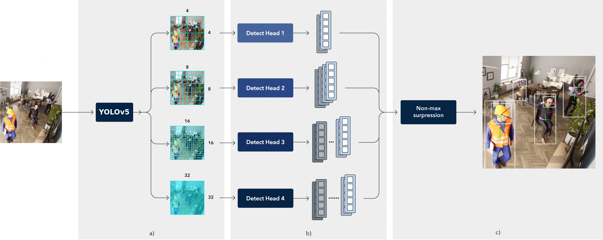

# 6DDirect H+B: Body-Aware Head Pose Estimation
In a well-functioning democratic constitutional state, it is crucial for professionals such as journalists and politicians to work unimpeded, yet threats against them have increased, necessitating surveillance.
Manual surveillance requires extensive manpower and is limited in effectiveness, leading to the adoption of computer vision systems.
Our research aims to enhance surveillance by accurately predicting head and body rotation, as well as gaze direction, in surveillance footage.

To achieve this, we developed a model named *6DDirect H+B* that accurately determines the 6D poses of head and body for multiple individuals in surveillance images.
This model addresses challenges such as occlusions, varying subject distances from the camera, and diverse lighting conditions.
By integrating localization, classification, and rotation learning within a unified framework using a fine-tuned YOLOv5 backbone, our approach enhances the accuracy of rotation estimation.
Then, we apply 6DDirect H+B to the task of gaze direction estimation, using an LSTM to leverage changes in head and body rotations over time to predict where a person is looking, to demonstrate the effectiveness of our approach.



We would like to extend our gratitude to the following repositories, as much of our code was inspired by and adapted from their work:

- [DirectMHP](https://github.com/hnuzhy/DirectMHP)
- [Dynamic 3D Gaze from Afar](https://github.com/kyotovision-public/dynamic-3d-gaze-from-afar)
- [YOLOv5](https://github.com/ultralytics/yolov5)

We highly encourage you to explore these repositories for more in-depth insights and advancements in the field.

## Table of Contents
* [Datasets - Head Pose and Body Orientation Estimation](#datasets-head-pose-and-body-orientation-estimation)
    - [AGORA](#agora)
    - [CMU](#cmu)
* [Datasets - Gaze Direction Estimation](#datasets-gaze-direction-estimation)
    - [GAFA](#gafa)
* [Method: 6DDirect H+B](#6ddirect-hb)
    - [Installation](#installation1)
* [Method: Gaze Direction Estimation](#gazenet)
    - [Installation](#installation2)
* [Baselines for Head Pose Estimation](#baselines-for-head-pose-estimation)
    - [6DRepNet](#6drepnet)
    - [DirectMHP](#directmhp)

<a name="datasets-head-pose-and-body-orientation-estimation"></a>
## Datasets - Head Pose and Body Orientation Estimation

<!-- TOC --><a name="agora"></a>
### AGORA
* Project link: [https://agora.is.tue.mpg.de/]. Github link: [https://github.com/pixelite1201/agora_evaluation]. Using and downloading this dataset needs personal registration. You can construct AGORA-H+B following the steps below.

#### Step 1: Download Raw Images
1. **Download the raw images for train-set and validation-set from [AGORA website](https://agora.is.tue.mpg.de/download.php).**
2. **Create necessary directories and extract the downloaded images:**

    ```bash
    mkdir -p AGORA/demo/images
    cd AGORA
    unzip ./path/to/download/validation_images_1280x720.zip -d demo/images
    unzip ./path/to/download/train_images_1280x720_<id>.zip -d demo/images

    # Move 10 folders of train-set raw images into one folder. The id is from 0 to 9.
    mv demo/images/train_<id>/* demo/images/train
    ```

#### Step 2: Download and Extract Raw Data
1. **Download the following raw data from the [AGORA website](https://agora.is.tue.mpg.de/download.php):**
   - Camera (approx. 392KB) -> train_Cam.zip & validation_Cam.zip
   - SMPL-X fits gendered (1.3GB) -> smplx_gt.zip
   - Scan/Fit Info (43KB) -> gt_scan_info.zip
   - SMIL (SMPL-X format), the kid model -> smplx_kid_template.npy

2. **Create necessary directories and extract the downloaded files:**

    ```bash
    mkdir -p demo/Cam/validation_Cam demo/Cam/train_Cam demo/GT_fits demo/model/smplx

    # Extract Camera data
    unzip -j ./path/to/download/validation_Cam.zip validation_Cam/Cam/* -d demo/Cam/validation_Cam/
    unzip -j ./path/to/download/train_Cam.zip -d demo/Cam/train_Cam/

    # Extract SMPL-X fits and Scan/Fit Info
    unzip ./path/to/download/gt_scan_info.zip -d demo/GT_fits
    unzip ./path/to/download/smplx_gt.zip -d demo/GT_fits
    ```

3. **Download and extract the SMPL-X models (npz version) from [SMPL-X website](https://smpl-x.is.tue.mpg.de/download.php):**

    ```bash
    unzip ./path/to/download/models_smplx_v1_1.zip SMPLX_FEMALE.npz SMPLX_MALE.npz SMPLX_NEUTRAL.npz -d demo/model/smplx/
    ```

#### Step 3: Download AGORA Evaluation Code and Generate `Cam/*_withjv.pkl` Files
1. **Clone the AGORA evaluation repository:**

    ```bash
    git clone https://github.com/pixelite1201/agora_evaluation
    cd agora_evaluation
    # If this fails, change sklearn to scikit-learn in `setup.py`
    pip install .
    ```

2. **Move the downloaded SMIL kid model template:**

    ```bash
    mv ./path/to/download/smplx_kid_template.npy ./utils/
    ```

3. **Create symbolic links and replace with modified files:**

    ```bash
    # Using full path is necessary!
    ln -s ~/full/path/to/AGORA/demo ~/full/path/to/AGORA/agora_evaluation/demo

    # Replace with two modified files
    cp ../../exps/AGORA/agora_evaluation/projection.py agora_evaluation/
    cp ../../exps/AGORA/agora_evaluation/get_joints_verts_from_dataframe.py agora_evaluation/
    cp ../../exps/AGORA/agora_evaluation/project_points.py agora_evaluation/
    ```

4. **Install the SMPL-X model:**

    ```bash
    git clone https://github.com/vchoutas/smplx ../smplx
    cd ../smplx
    pip install .
    ```

5. **Run the script to generate the .pkl files with joint and vertex data:**

    ```bash
    cd ../agora_evaluation

    # Validation
    python agora_evaluation/project_joints.py --imgFolder demo/images/validation --loadPrecomputed demo/Cam/validation_Cam \
      --modeltype SMPLX --kid_template_path utils/smplx_kid_template.npy --modelFolder demo/model \
      --gt_model_path demo/GT_fits/ --imgWidth 1280 --imgHeight 720
    
    # Train
    python agora_evaluation/project_joints.py --imgFolder demo/images/train --loadPrecomputed demo/Cam/train_Cam \
      --modeltype SMPLX --kid_template_path utils/smplx_kid_template.npy --modelFolder demo/model \
      --gt_model_path demo/GT_fits/ --imgWidth 1280 --imgHeight 720
    ```
    NOTE: This takes a long time and a lot of memory.

#### Step 4: Generate the Final AGORA-H+B Dataset
1. **Create directories for the final dataset and annotations:**

    ```bash
    cd ..
    mkdir -p H_B/images/validation H_B/images/train H_B/annotations
    ```

2. **Copy necessary scripts and process the data:**

    ```bash
    cp ../exps/AGORA/H_B_data_process.py ./
    cp ../exps/AGORA/H_B_utils.py ./

    # Generate head and body bounding boxes + 6D rotations
    python H_B_data_process.py --load_pkl_flag # for head and body
    ```

#### Step 5: Prepare Labels for Training
1. **Ensure labels are within the [0, 1] range and write them to the correct files for YOLOv5 integration:**

    ```bash
    cd ../sixDDirect_H_B/
    python utils/labels.py --data data/agora_coco_H_B.yaml # data/agora_coco.yaml for heads only
    ```

This should give approximately the following folder setup for AGORA:

```bash
└── AGORA
    ├── agora_evaluation/
    │   ├── agora_evaluation/
    │   └── ...
    ├── demo/
    │   ├── Cam/
    │   │   ├── train_Cam/
    │   │   └── validation_Cam/
    │   ├── GT_fits/
    │   │   ├── gt_scan_info/
    │   │   └── smplx_gt/
    │   │       └── ...
    │   ├── images/
    │   │   ├── train/
    │   │   └── validation/
    │   └── model/
    │       └── smplx/
    ├── H_B/
    │   ├── 6D_body_head_yolov5_labels_coco/
    │   │   ├── img_txt/
    │       ├── train/
    │   │   └── validation/
    │   ├── annotations/
    │       ├── full_body_head_coco_style_train.json
    │       └── full_body_head_coco_style_validation.json
    │   └── images/
    │       ├── train/
    │       └── validation/
    └── smplx/
        └── ...
```

<!-- TOC --><a name="cmu"></a>
### CMU
* Project link: [http://domedb.perception.cs.cmu.edu/]. Github link: [https://github.com/CMU-Perceptual-Computing-Lab/panoptic-toolbox]. Using and downloading this dataset needs `personal registration`. We have no right to directly disseminate its data. You can construct CMU-H+B following steps below.

#### Step 1: Setting Up Directories and Copying Necessary Scripts

1. **Create and navigate to the `CMU` directory:**

    ```bash
    mkdir CMU
    cd CMU
    ```

2. **Copy the necessary scripts and Python files from the `exps` directory:**

    ```bash
    cp -r ../exps/scripts ./
    cp ../exps/H_B_data_process.py ./
    cp ../exps/H_B_utils.py ./
    cp ../exps/data_split.py ./
    ```

3. **Understanding the Provided Files:**

- **`scripts/`**:
    - This directory contains scripts from the [CMU-Perceptual-Computing-Lab/panoptic-toolbox](https://github.com/CMU-Perceptual-Computing-Lab/panoptic-toolbox) and some modifications made by DirectMHP and this author.
    
- **`H_B_data_process.py`**:
    - Tweaked from DirectMHP GitHub to get head and body rotations.
    - Downloads data in a loop and directly removes folders to manage the large data size from the CMU Panoptic dataset.

- **`data_split.py`**:
    - Modified from DirectMHP GitHub to accommodate different COCO dictionary templates.
    
- **`H_B_utils.py`**:
    - Adjusted from DirectMHP GitHub to e.g. include a reference body.

#### Step 3: Processing the CMU Panoptic Dataset

The dataset is very large and downloading it will take a long time. To manage this:

- We process and sample data per sequence.
- Delete the folder after processing each sequence to save space.
- Save annotations after processing each sequence to prevent data loss if something crashes.

1. **Create a directory for head and body data processing:**

    ```bash
    mkdir H_B
    ```

2. **Run the data processing script:**

    ```bash
    python H_B_data_process.py  # Processes head and body data
    ```

#### Step 4: Combining and Splitting the Data

After processing and saving annotations for each sequence:

1. **Combine the separate annotations into a single file and split it into training and validation datasets:**

    ```bash
    python data_split.py
    ```

#### Step 5: Prepare Labels for Training
1. **Ensure labels are within the [0, 1] range and write them to the correct files for YOLOv5 integration:**

    ```bash
    cd ../sixDDirect_H_B/
    python utils/labels.py --data data/cmu_panoptic_coco_H_B.yaml # data/cmu_panoptic_coco.yaml for heads only
    ```

This should approximately give the following folder structure for CMU:

```bash
└── CMU/
    ├── H_B/
    │   ├── 6D_body_head_yolov5_labels_coco/
    │   │   ├── img_txt/
    │   │   ├── train/
    │   │   └── val/
    │   ├── annotations/
    │   │   ├── coco_style_sample.json
    │   │   ├── coco_style_sampled_train.json
    │   │   └── coco_style_sampled_validation.json
    │   ├── images/
    │   │   ├── train/
    │   │   └── validation/
    │   └── images_sampled/
    └── scripts/
```

<!-- TOC --><a name="datasets-gaze-direction-estimation"></a>
## Datasets - Gaze Direction Estimation

<!-- TOC --><a name="gafa"></a>
### GAFA

#### Step 1: Downloading the Dataset

Download the data from the [GAFA GitHub](https://github.com/kyotovision-public/dynamic-3d-gaze-from-afar). Note that this will take a very long time due to the large file sizes. Place the downloaded files in the `GazeNet/data/raw_data` folder.

#### Step 2: Processing the Dataset

**Option 1: Process All Data at Once (Requires Ample Disk Space)**. 
Extract and preprocess each tar.gz file:

```bash
cd GazeNet/
names=("living_room" "courtyard" "library" "kitchen" "lab")
for NAME in "${names[@]}"; do
  tar -zxvf "data/raw_data/$NAME.tar.gz"
done

python data/preprocess.py
python data/reprocess.py
```

**Option 2: Process Data One Folder at a Time (For Limited Disk Space)**. 
Unzip, preprocess, and clean up each folder one by one:

```bash
cd GazeNet/
names=("living_room" "courtyard" "library" "kitchen" "lab")
for NAME in "${names[@]}"; do
  tar -zxvf "data/raw_data/$NAME.tar.gz"
  python data/preprocess.py
  rm -rf "$NAME"
done

python data/reprocess.py
```

#### Step 3: Details of Processing Scripts

- **`preprocess.py`**:
    - Processes the GAFA dataset to create annotations and pickle files.
    - Steps per video:
        1. For all directions (gaze, body, head), get the corresponding rotation matrices.
        2. Resize the frames so the width is 720 pixels.
        3. Extract head and body bounding boxes from OpenPose 2D annotations.
        4. Save all frames to an `image.pkl` file.
        5. Save all annotations to an `annotations.pkl` file.
    - Note: Long videos are split into three parts to save RAM.

- **`reprocess.py`**:
    - Further processes the preprocessed data.
    - Steps:
        1. Load annotations.
        2. Get consecutive frames (skipping frames where subjects walk out of frame).
        3. Limit outlier widths and heights to a maximum of ±0.75 the standard deviation.
        4. Smooth the x, y locations over 7 frames using Gaussian kernel convolution.

#### Step 4: Generating COCO Style Annotations and Splitting Data

1. **Run the `coco_GAFA.py` script:**

    ```bash
    python data/coco_GAFA.py
    ```

    - **`coco_GAFA.py`**:
        - Converts GAFA dataset to COCO style annotations.
        - Steps:
            1. Samples every 7th frame of valid frames.
            2. Gets all valid frames for samples and their annotations (bounding boxes, gaze/head/body direction, 6D poses, Euler angles).
            3. Saves image information and annotations to a COCO style dictionary.

2. **Run the `split_GAFA.py` script:**

    ```bash
    python data/split_GAFA.py
    ```

    - **`split_GAFA.py`**:
        - Splits the COCO style annotations into training and validation sets (75% train, 25% validation).

#### Step 5: Prepare Labels for Training
1. **Ensure labels are within the [0, 1] range and write them to the correct files for YOLOv5 integration:**

    ```bash
    cd ../sixDDirect_H_B/
    python utils/labels.py --data data/gafa_coco_H_B.yaml # data/gafa_coco.yaml for heads only
    ```

This should give this approximate folder structure:
```bash
└── GazeNet/data/preprocessed/
    ├── courtyard/
    ├── H_B_G/
    │   ├── 6D_body_head_yolov5_labels_coco/
    │   │   ├── img_txt/
    │   │   ├── train/
    │   │   └── val/
    │   ├── annotations/
    │   │   ├── GAFA_coco_style.json
    │   │   ├── GAFA_coco_style_train.json
    │   │   └── GAFA_coco_style_validation.json
    │   ├── images/
    │   │   ├── train/
    │   │   └── validation/
    ├── kitchen/
    ├── lab/
    ├── library/
    └── living_room/
```

<!-- TOC --><a name="6ddirect-hb"></a>
## Method: 6DDirect H+B

<!-- TOC --><a name="installation1"></a>
### Installation

This repository contains methods for validating, training, and inferring models that predict heads and bodies directly, specifically for the AGORA, CMU Panoptic, and GAFA datasets.

The first step is setting up the environment by doing the following:

```bash
git clone https://github.com/noanonkes/6DDirect_H_B
cd 6DDirect_H_B/sixDDirect_H_B/

conda env create -f conda.yaml
conda activate hb

pip3 install torch==1.10.0+cu111 torchvision==0.11.1+cu111 torchaudio==0.10.0+cu111 \
  -f https://download.pytorch.org/whl/cu111/torch_stable.html
```

Install the renderer, which is used to visualize predictions.

```bash
cd Sim3DR
sh build_sim3dr.sh
```

**NOTE**: All files in `sixDDirect_H_B` need to be called within the `hb` environment. 

### Validate 6DDirect H+B and MHP

#### Prerequisites
First, download the necessary weights from [here](https://huggingface.co/noanonk/6DDirect_H_B) and place them in the `weights` folder.

#### Testing on AGORA

To validate the model that predicts both heads and bodies directly on the AGORA dataset, execute the following command:

```bash
python val.py --rect --data data/agora_coco_H_B.yaml --img 1280 \
  --weights weights/agora_m_1280_e300_t40_bs32_c04_b04_h06 \
  --batch-size 16 --device 0
```

For testing the model that only predicts heads on AGORA, use this command:

```bash
python val.py --rect --data data/agora_coco.yaml --img 1280 \
  --weights weights/agora_m_1280_e300_t40_bs32_H \
  --batch-size 16 --device 0
```

#### Testing on CMU Panoptic or GAFA

To test on the CMU Panoptic or GAFA dataset, adjust the `--data` and `--weights` flags accordingly.

### Train 6DDirect H+B and MHP

#### Training from Scratch

You can train the models from scratch. The instructions below are based on using two GPUs; adjust the `--device` flag according to your setup.

For training the head and body model on AGORA:

```bash
python train.py --workers 9 --device 0,1 \
  --img 1280 --batch 32 --epochs 300 --data data/agora_coco_H_B.yaml --hyp data/hyp-p6.yaml \
  --weights weights/yolov5m6.pt --project runs/6DDirect_H_B \ 
  --conf_thres 0.4 --conf_thres_body 0.4 --conf_thres_head 0.4 \
  --l2_loss_w 0.1 --name agora_m_1280_e300_t40_bs32_c04_b04_h06 --bbox_interval 50
```

For training a model that only predicts heads:

```bash
python train.py --workers 9 --device 0,1 \
  --img 1280 --batch 32 --epochs 300 --data data/agora_coco.yaml --hyp data/hyp-p6.yaml \
  --weights weights/yolov5m6.pt --project runs/6DDirectMHP --conf_thres 0.4 \
  --l2_loss_w 0.1 --name agora_m_1280_e300_t40_bs32_c04 --bbox_interval 50
```

#### Training on CMU Panoptic or GAFA

To train on the CMU Panoptic or GAFA datasets, modify the `--name`, `--data`, and `--weights` flags as needed.

### Inference 6DDirect H+B and MHP

For testing trained or pre-trained models on your own images, use the `image_vis3d.py` script. Place all images in the `test_imgs` folder and adjust the weights accordingly.

```bash
python demos/image_vis3d.py \
 --imgsz 1280 \
 --weights weights/agora_m_1280_e300_t40_bs32_H \
 --img-path test_imgs \
 --data data/agora_coco_H_B.yaml
```

<!-- TOC --><a name="gazenet"></a>
## Method: GazeNet

GazeNet involves a two-step process: first, obtaining head and body predictions, and then predicting gaze directions. This separation allows for independent experimentation with gaze predictions.

<!-- TOC --><a name="installation2"></a>
### Installation

The first step is setting up the environment by doing the following:

```bash
cd GazeNet/
conda env create -f conda.yaml
```

**NOTE**: All files in `GazeNet` need to be called within the `gafa` environment. 

### Head and Body Orientation Predictions

First, get the head and body orientation predictions on the GAFA dataset:

```bash
# needs to be done with other environment
conda activate hb

cd sixDDirect_H_B/
python GAFA/predictions.py --data data/gafa_coco_H_B.yaml --img 720 \
  --weights weights/gafa_ptAGORA_720_e50_t40_b128_b04_h06.pt \
  --batch-size 128 --device 0 --iou-thres 0.5 --conf-thres 0.0001
```

Since GazeNet LSTM trains with 7-frame sequences, extract valid samples for each 7-frame sequence:

```bash
python GAFA/valid_frames.py
```

### Train GazeNet

To train GazeNet, run:

```bash
cd GazeNet/
conda activate gafa

python train.py
```

### Evaluate GazeNet

To evaluate using pre-trained weights, download the weights from [here](https://huggingface.co/noanonk/6DDirect_H_B) and place them in the `GazeNet/output` folder. Then, run:

```bash
python eval.py
```

<!-- TOC --><a name="baselines-for-head-pose-estimation"></a>
## Baselines for Head Pose Estimation

<!-- TOC --><a name="6drepnet"></a>
### 6DRepNet
For complete steps on downloading and installing 6DRepNet, we refer to their [GitHub](https://github.com/thohemp/6DRepNet).

1. **Clone the 6DRepNet repository from their GitHub.**

2. **Create the output directory and download the pre-trained weights:**

    ```bash
    mkdir output
    wget https://huggingface.co/HoyerChou/DirectMHP/resolve/main/SixDRepNet_AGORA_bs256_e100_epoch_last.pth -P output/
    wget https://huggingface.co/HoyerChou/DirectMHP/resolve/main/SixDRepNet_CMU_bs256_e100_epoch_last.pth -P output/
    ```

3. **Copy the necessary files from the `exps/sixdrepnet` directory:**

    ```bash
    cp ../../exps/sixdrepnet/gen_dataset_full_AGORA_CMU.py ./
    cp ../../exps/sixdrepnet/test.py ./
    cp ../../exps/sixdrepnet/datasets.py ./
    cp ../../exps/sixdrepnet/model.py ./
    cp ../../exps/sixdrepnet/utils.py ./
    ```

#### Overview of Files and Changes:
Most of the files are originally from [DirectMHP](https://github.com/hnuzhy/DirectMHP/) which we tweaked.
- **`gen_dataset_full_AGORA_CMU.py`**: 
    - Tweaked to fix file paths and skip annotations that are not heads, as the dataset now includes heads and bodies.
- **`test.py`**: 
    - Adjusted to add the geodesic distance metric.
- **`datasets.py`, `model.py`, `utils.py`**: 
    - Sourced from the DirectMHP GitHub.

#### Generating Head Crops and Testing:

1. **Generate head crops for AGORA:**

    ```bash
    python gen_dataset_full_AGORA_CMU.py --db ../../AGORA/agora_evaluation/HPE/ --img_size 256 --root_dir ./datasets/ --data_type val --filename files_val.txt
    ```

2. **Test on AGORA:**

    ```bash
    python test.py --dataset AGORA --data_dir ./datasets/AGORA/val --filename_list ./datasets/AGORA/files_val.txt --snapshot output/SixDRepNet_AGORA_bs256_e100_epoch_last.pth --gpu 0 --batch_size 1
    ```

3. **Generate head crops for CMU:**

    ```bash
    python gen_dataset_full_AGORA_CMU.py --db ../../CMU/HPE/ --img_size 256 --root_dir ./datasets/ --data_type val --filename files_val.txt
    ```

4. **Test on CMU:**

    ```bash
    python test.py --dataset CMU --data_dir ./datasets/CMU/val --filename_list ./datasets/CMU/files_val.txt --snapshot output/SixDRepNet_CMU_bs256_e100_epoch_last.pth --gpu 0 --batch_size 1
    ```

<!-- TOC --><a name="directmhp"></a>
### DirectMHP
For complete steps on downloading and installing DirectMHP, we refer to their [GitHub](https://github.com/hnuzhy/DirectMHP/).

1. **Clone the DirectMHP repository from their GitHub**

2. **Download the pre-trained weights:**

    ```bash
    wget https://huggingface.co/HoyerChou/DirectMHP/resolve/main/agora_m_1280_e300_t40_lw010_best.pt -P weights/
    wget https://huggingface.co/HoyerChou/DirectMHP/resolve/main/cmu_m_1280_e200_t40_lw010_best.pt -P weights/
    ```

3. **Copy the necessary files:**

    ```bash
    cp ../exps/DirectMHP/val.py ./
    cp ../exps/DirectMHP/data/{agora_coco,cmu_panoptic_coco}.yaml ./data/
    cp ../exps/DirectMHP/utils/mae.py ./utils/
    cp -r ../exps/DirectMHP/visualize/ ./
    ```

#### Overview of Files and Changes:
- **`val.py`**: 
    - Added calculation for geodesic distance.
- **`utils/mae.py`**: 
    - Added geodesic loss class, geodesic error as return, and skipped classifications that are not heads.
- **`data/agora_coco.yaml`**: 
    - Updated paths to data.
- **`visualize/*`**: 
    - New code for comparisons between our method and DirectMHP.

#### Evaluating:

1. **Evaluate on the AGORA dataset:**

    ```bash
    python val.py --rect --data data/agora_coco.yaml --img 1280 --weights weights/agora_m_1280_e300_t40_lw010_best.pt --batch-size 8 --device 0
    ```

2. **Evaluate on the CMU dataset:**

    ```bash
    python val.py --rect --data data/cmu_panoptic_coco.yaml --img 1280 --weights weights/cmu_m_1280_e200_t40_lw010_best.pt --batch-size 8 --device 0
    ```